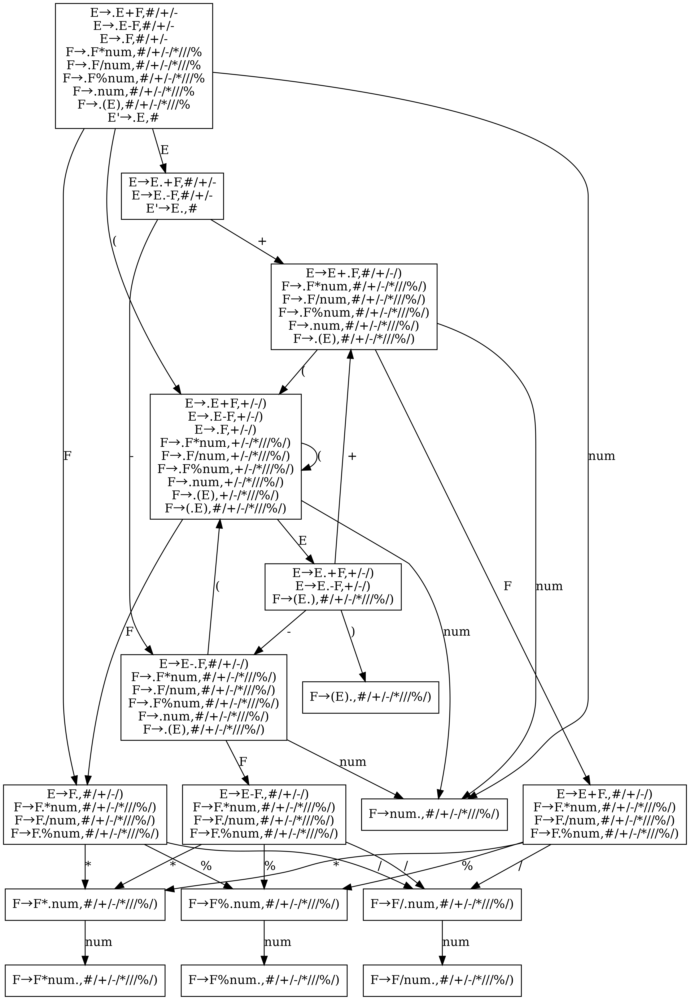

## Introduction

A lalr1(1) parser generator in & for rust.

Support some yacc/bison features, e.g., precedence and associativity.

There was a naive `lalr1_by_lr1` implementation, which is removed now. Its efficiency is not too bad, but still significantly slower than yacc/bison.

Now a more efficient method `lalr1_by_lr0` is applied. It has about the same speed as yacc/bison. You can refer to the dragon book for the theory about this method.

Future extension: 

- [x] multiple language codegen, e.g., cpp
- [x] using other parsing technique, e.g., ll(1)
- [x] use dfa to implement lexical analysis, instead of using many regular expressions now

---

Currently this repository provided 4 tools that can be used directly, including 2 executable programs and 2 proc macros. They are listed as follow.

## `simple_grammar`: show lr fsm

Run `simple_grammar` for help:

```bash
$ cargo run --example simple_grammar -- --help
```

Or run a specific example:

```bash
$ cargo run --example simple_grammar -- parser-gen/examples/expr.cfg -g lalr1 -o expr.dot
```

Then use your favorite dot file viewer to view this file, you will get:



Note that you can also use ll(1) grammar in `simple_grammar`, but since I don't know any proper way to show ll(1) table in graphics, it will just show some text information, including first/follow/predict set.

## `parser_gen`: toml to rust

Run `parser_gen` for help:

```bash
$ cargo run --example parser_gen -- --help
```

Or run a specific example:

```bash
# actually we now support cpp & rust
# this is a rust example
$ cargo run --example parser_gen -- parser-gen/examples/calc.toml -o calc.rs -l rs
# this is a cpp example
$ cargo run --example parser_gen -- parser-gen/examples/calc_cpp.toml -o calc.cpp -l cpp
```

Now `calc.rs` will contain a `struct Parser` and a `struct Lexer`. Their apis are easy to understand.

## `#[lalr1]`

Use rust's proc macro to describe the grammar.

The specific api of proc macro is described in [another documentation](https://mashplant.gitbook.io/decaf-doc/pa1a/lalr1-shi-yong-zhi-dao) (in Chinese), which is part of the experiment guide of THU compiling principle course. It will take me too much time if I am to maintain an English version of this documentation at the same time.

See `tests/src/lalr1.rs` to have a glance at the usage.

## `#[ll1]`

Like `#[lalr1]`, but use ll(1) grammar. The parser generator won't try to solve the problem of left recursion or left common factor, precedence and associativity will also be ignored. All have to be done manually. 

`#[ll1]` will generate a `parse(lexer)` function for `Parser`, and it will call `Parser::_parse`, which is supposed to be implemented by the user. When carefully implemented, this can provide some error recovering.

See `tests/src/ll.rs` to have a glance at the usage, note that error recovering is not implemented in this file.
