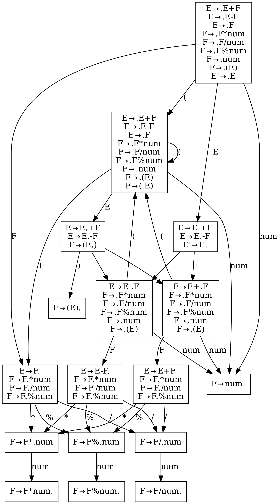
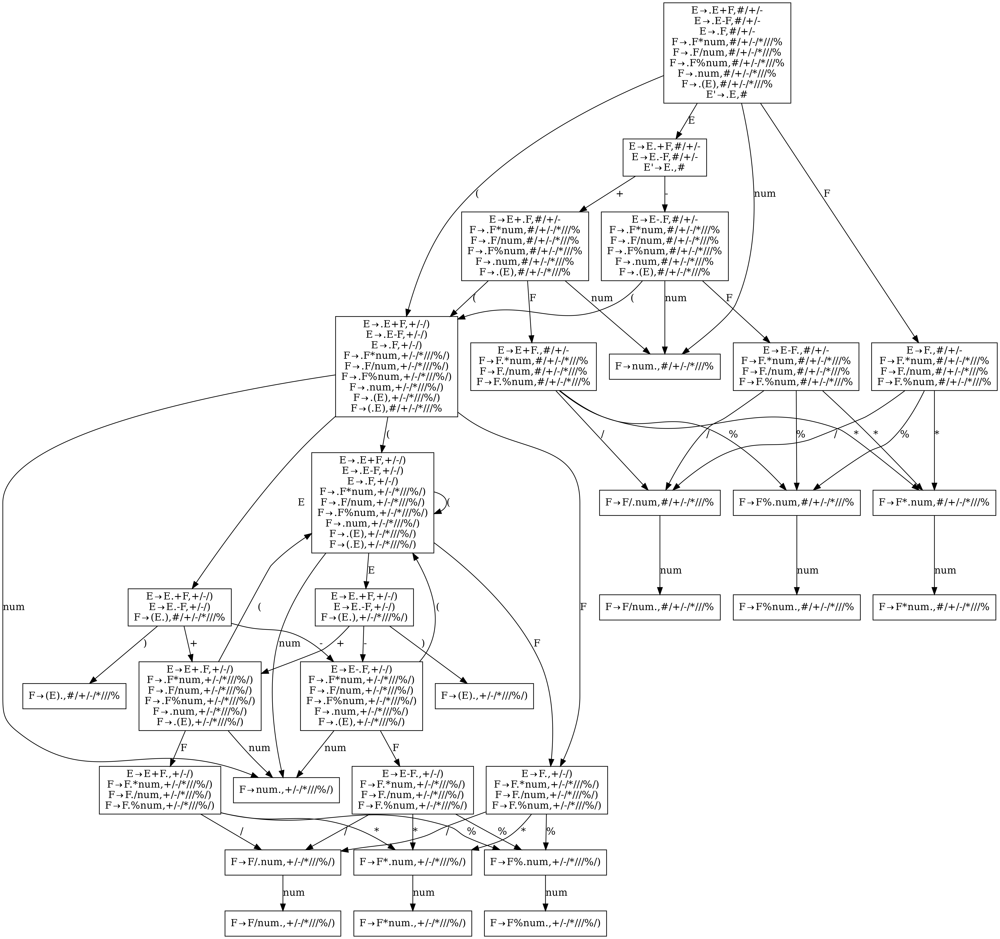
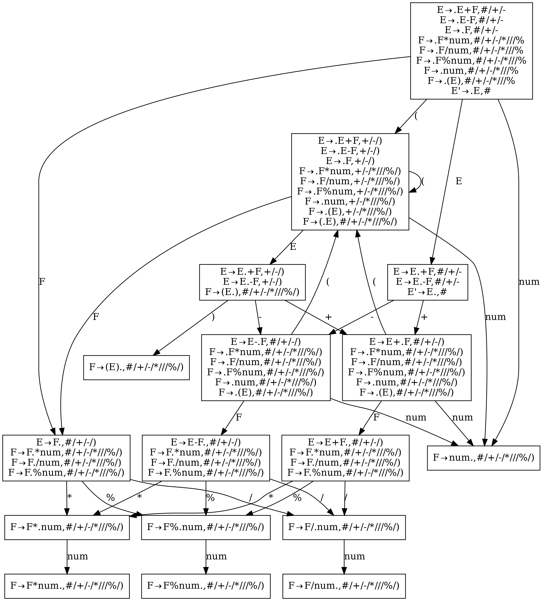

A LALR(1) parser generator in & for rust.

Support some yacc/bison features, e.g., precedence and associativity(though the syntax is a little different).

Implement LALR(1) by naive `lalr1_by_lr1` and `lalr1_by_lr0`. To generate the parser of [decaf](https://github.com/MashPlant/decaf), it takes about 2s and 0.2s respectively.

Future extension: 

1. multiple language codegen, e.g., cpp
2. using other parsing technique, e.g., LL(1)
3. use DFA to implement lexical analysis, instead of using many regular expressions now

---

New feature: generate .dot file to visualize lr0/lr1/lalr1 fsm.

example:

grammar:

```
E -> E + F
E -> E - F
E -> F
F -> F * num
F -> F / num
F -> F % num
F -> num
F -> ( E )
```

picture:

lr0:



lr1:



lalr1:


