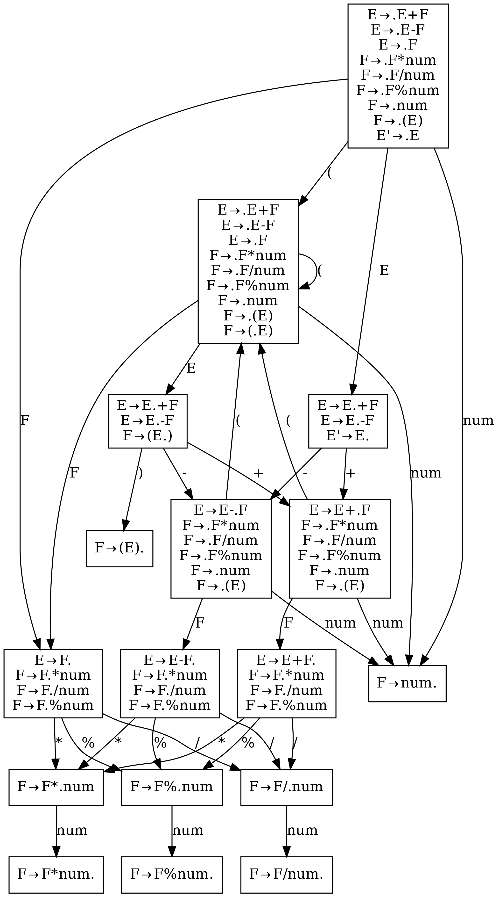
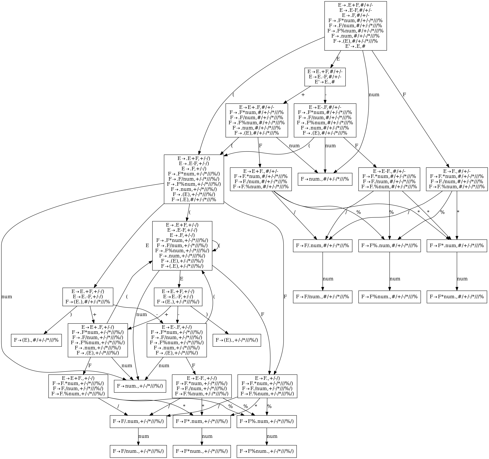
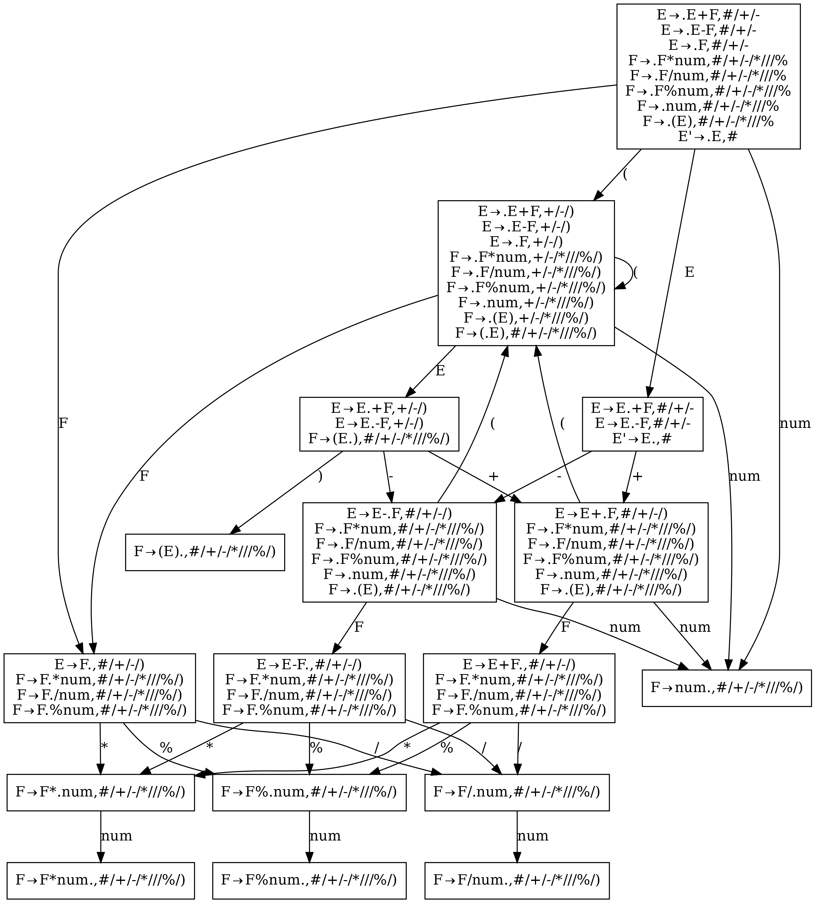

A LALR(1) parser generator in & for rust.

Support some yacc/bison features, e.g., precedence and associativity(though the syntax is a little different).

Implement LALR(1) by naive `lalr1_by_lr1` and `lalr1_by_lr0`. To generate the parser of [decaf](https://github.com/MashPlant/decaf), it takes about 2s and 0.2s respectively.

Future extension: 

- [ ] multiple language codegen, e.g., cpp
- [ ] using other parsing technique, e.g., LL(1)
- [x] use DFA to implement lexical analysis, instead of using many regular expressions now

---

## Codegen tool: toml to rust

Quite a traditional approach. Use a toml to describe the grammar, and generate it to source code of rust. The generated code has no extra dependency.

## #[lalr1]

Use rust's proc macro to describe the grammer.

```rust
#[lalr1(Expr)]
#[term(IntConst(r"\d+"))]
#[term(_Eps(r"\s+"))]
#[term(Add(r"\+" left) Sub("-" left))]
#[term(Div("/" left) Mul(r"\*" left) Mod("%" left))]
#[term(RParen(r"\)" no_assoc))]
#[term(LParen(r"\("))]
#[term(UMinus(no_assoc))]
impl Parser {
  #[rule(Expr -> Expr Add Expr)]
  fn expr_add(l: i32, _op: Token<'_>, r: i32) -> i32 {
    println!("Add {} {}", l, r);
    l + r
  }

  #[rule(Expr -> Expr Sub Expr)]
  fn expr_sub(l: i32, _op: Token<'_>, r: i32) -> i32 {
    println!("Sub {} {}", l, r);
    l - r
  }

  #[rule(Expr -> Expr Mul Expr)]
  fn expr_mul(l: i32, _op: Token<'_>, r: i32) -> i32 {
    println!("Mul {} {}", l, r);
    l * r
  }

  #[rule(Expr -> Expr Div Expr)]
  fn expr_div(l: i32, _op: Token<'_>, r: i32) -> i32 {
    println!("Div {} {}", l, r);
    l / r
  }

  #[rule(Expr -> Expr Mod Expr)]
  fn expr_mod(l: i32, _op: Token<'_>, r: i32) -> i32 {
    println!("Mod {} {}", l, r);
    l % r
  }

  #[rule(Expr -> Sub Expr)]
  #[prec(UMinus)]
  fn expr_neg(_op: Token<'_>, r: i32) -> i32 {
    println!("Neg {}", r);
    -r
  }

  #[rule(Expr -> LParen Expr RParen)]
  fn expr_paren(_l: Token<'_>, i: i32, _r: Token<'_>) -> i32 {
    println!("Paren {}", i);
    i
  }

  #[rule(Expr -> IntConst)]
  fn expr_int(i: Token<'_>) -> i32 {
    let int = std::str::from_utf8(i.piece).unwrap().parse::<i32>().unwrap();
    println!("Int {}", int);
    int
  }
}
```

A pity is that I don't know how to expand macro in proc macro. If so, we can simply write

```rust
bin!(expr_add, Add, +);
bin!(expr_sub, Sub, -);
...
```

which is more straightforward.

## What does lr fsm looks like

example:

grammar:

```
E -> E + F
E -> E - F
E -> F
F -> F * num
F -> F / num
F -> F % num
F -> num
F -> ( E )
```

picture:

lr0:



lr1:



lalr1:


